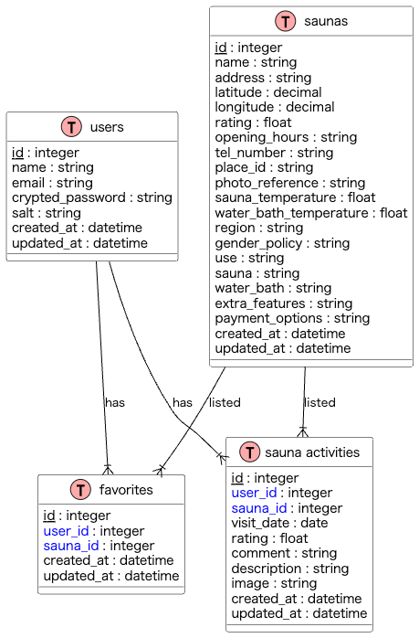

# プライベートサウナポータル(仮）

## サービス概要
プライベートサウナに特化したサービスで、全国のプライベートサウナを一覧で見ることができます。ログインすると、気になるサウナに「いいね」をつけたり、訪問した感想を書くことができるようになります。

## このサービスの思い・作りたい理由
最近、自宅の近くにプライベートサウナができ、利用してみたところ、人目を気にせず入れる手軽さがいいなと思いました。
また、セルフロウリュも自分のペースで行うことができるので、
自分の好きな温度にいつでも調整できるのが魅力だなと感じました。一人で入ったり、友達といっしょに入ったりと場面を選んで楽しむことも
できるので、素敵です。
サウナに入ることで、睡眠改善・脳疲労がすぐに消える・ダイエットなど
嬉しい効能がたくさんあるので、もっとたくさん広まってほしいと思ったからです。

## ユーザー層
- プライベートサウナを一人で利用したい人
- 友達とプライベートな空間でリラックスしたい人

## サービスの利用イメージ
- **サウナ一覧表示**: 全国のプライベートサウナが一覧で表示されます。
- **検索機能**: サウナの温度、水風呂の温度、地域、利用条件など、多岐にわたる条件でフィルタリングが可能です。
- **ユーザー評価**: 訪問後のレビュー投稿が可能で、星評価や写真も追加できます。

## ユーザーの獲得戦略
- **SNSマーケティング**: Instagramを主軸に、実際のサウナ画像やユーザーレビューを共有して、興味を引きます。

## サービスの差別化ポイント
- プライベートサウナ特化**: 他のサウナアプリと異なり、プライベートサウナのみを対象としています。
- レビューとおすすめ機能**: 利用者のレビューや星マークでの評価を基に、ユーザーの好みに合わせたサウナを推薦します。
- だれとサ活したのか記録できる(サ活で思い出作りができる）
- レビューを書く際に星マークで評価をつけることができる

## MVPリリース機能
- 全国のプライベートサウナ一覧で閲覧
- 詳細検索機能
  - サウナ　（プルダウン：選択なし,-10度〜150度）
  - 水風呂　（プルダウン：選択なし,0度〜30度）
  - 地域　（プルダウン：　各地方）
  - 条件　（プルダウン：　男女で入れる→「裸で入れる」「水着着用」
    - 利用→「宿泊者のみ」「日帰り入浴可」「会員のみ」
    - サウナタイプ→「ドライサウナ」「スチームサウナ」「ミストサウナ」など
    - 水風呂タイプ→「シャワーのみ」「水風呂」「冷凍ルーム」
    - マニアック→「外気浴スペース」
    - 支払い方法→「クレジットカード」「現金」「電子マネー」
  - キーワードから探す（地名・施設名）
- 新規ユーザー登録機能
- ログイン機能
- パスワード変更機能
- メールアドレス変更機能
- ログアウト機能
- プロフィール機能
- ログイン時
  - お気に入り機能
  - お気に入り解除機能
- サ活記録投稿機能
  - 訪問日
  - 口コミ
  - 星評価
  - いっしょにサ活（いっしょに行った人）を登録する機能
  - 画像投稿
  - 投稿するボタン
  - 投稿を削除する
  - サ活を編集

## 本リリース時
- ヘルス情報
- パーソナライズされたレコメンデーション: ユーザーの過去の行動や好みに基づいて、個々のユーザーに合わせたサウナ施設の推薦を行う機能。
- 新規登録機能【SNS連携(Twitter)】
- SNS認証解除機能

## 機能の実装方針予定
- 選択したサロンの位置を地図上に表示。地図機能（Google Maps API）
- ユーザーの行動パターンを分析するために、Google Analyticsを使用
- 全国のサウナ施設を一覧で表示するためにGoogle Places APIを使用
- 新規登録に利用するSNS認証（Twitter API)

## 技術スタック
- **開発環境**　Docker / docker-compose
- **フロントエンド**: Bootstrap
- **バックエンド**: Ruby on Rails 7.1.3.2
- **データベース**: PostgreSQL
- **インフラ**: Render
- **追加技術**: Google Maps API（地図表示）、Google Analytics（ユーザー行動分析）、Google Places API（全国のサウナ施設を一覧で表示）

## 画面遷移図
https://www.figma.com/file/lAmXCWpxhGY2y1cFBpHQSD/Project?type=whiteboard&node-id=0%3A1&t=if5wTgrGaLy36wQB-1

## ER図

